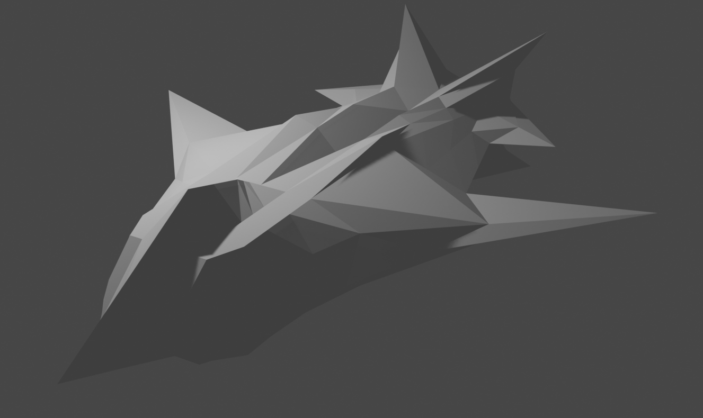

# Flat Shading

## Descripción
Este proyecto es una aplicación sencilla de renderización 3D escrita en C++ utilizando SDL para el renderizado gráfico con shaders y escribiendo un archivo bmp. Carga modelos 3D desde archivos OBJ. La demostración principal utiliza un modelo llamado `nave_espacial.obj`.

--------------------
## Imágenes de ejemplo
### Modelo en blender

### Carga sin shaders

### Carga con shaders

- Aclaración: La herramienta para convertir mkv a gif "corta" el color blanco, pero no se ve así al ejecutarse. 

### Out bmp

## Instalación
Para construir y ejecutar este proyecto, necesitarás:
- SDL2
- Compilador C++ (por ejemplo, GCC, Clang)
- CMake (opcional, para la construcción)

## Uso
Para ejecutar el programa, compila los archivos C++ y enlázalos con la biblioteca SDL2. Si tienes un archivo OBJ personalizado, colócalo en el directorio del proyecto y modifica la línea `loadOBJ` en `main.cpp` para usar tu archivo.
